<div align="center">

<a href="https://github.com/UtkarshPrajapat">
  
</a>

**Computer Science Undergraduate · Full-Stack Developer · GenAI Explorer**

<a href="https://readme-typing-svg.demolab.com">
  
</a>

<a href="https://www.niituiversity.com/"></a>
<a href="https://www.google.com/maps/search/?api=1&query=Gandhidham%2C%20Gujarat%2C%20India"></a>
<a href="mailto:utkarshprajapati1023@gmail.com"></a>
<a href="https://www.linkedin.com/in/utkarsh-prajapati-958a23292/"></a>
<a href="https://github.com/UtkarshPrajapat"></a>


</div>

### 👋 About Me
I’m a Computer Science undergraduate at NIIT University focused on building practical software products and real-world technology solutions.
I work across Java, Python, JavaScript, full-stack development, Generative AI and IoT, with a growing focus on backend engineering and scalable applications.
- B.Tech CSE — NIIT University
- Building with Java, Python, JavaScript, React, Next.js, Firebase, REST APIs and SQL
- Currently strengthening DSA, OOP, Spring Boot and Maven
- Exploring Generative AI and practical AI integration

### 🛠️ Tech Stack
**Languages**
Java, Python, JavaScript, HTML, CSS
<br>


**Frontend**
React, Next.js, Tailwind
<br>


**Backend / Databases / APIs**
Spring Boot, Firebase, MySQL, REST APIs, Firestore, SQL, DBMS
<br>


**AI / Development / Tooling**
Generative AI, Prompt Engineering, Git, GitHub, Vercel, Maven, Arduino
<br>


### 🤖 AI / GenAI
| Domain | Proficiency | Focus |
|---|---|---|
| **Generative AI** | Working Knowledge | AI integration and practical application development |
| **Prompt Engineering** | Working Knowledge | Designing structured prompts and AI-assisted workflows |
| **AI Integration** | Working Knowledge | Exploring how GenAI can enhance software products |

### 🚀 Featured Projects
<details><summary><b>FinFlow — MSME Cash Flow Platform</b></summary>

| Area | Details |
|---|---|
| **Stack** | React.js, Firebase, REST APIs, Vercel |
| **Core Features** | Cash-flow tracking, Expense categorization, INR dashboards, Plan management |
| **Backend** | Firebase Authentication, Real-time Firestore |
| **Deployment** | Vercel |
| **Impact** | Presented at Rajasthan Startup Summit 2026 and submitted to F6S |
</details>

<details><summary><b>Shreeji Vastraalay — Production E-Commerce Platform</b></summary>

| Area | Details |
|---|---|
| **Stack** | Next.js 15, Firebase, Razorpay, Tailwind CSS, Vercel |
| **Core Features** | Authentication, Product/order management, Cart, Checkout, Validation |
| **Payments** | Razorpay integration |
| **Deployment** | Vercel, Custom GoDaddy domain |
| **Security** | Revoked an exposed production API key, purged Git history using BFG Repo Cleaner, and migrated secrets to environment variables |
| **SEO** | Google Search Console, Google Business Profile |
</details>

<details><summary><b>Smart Water Pressure Management System</b></summary>

| Area | Details |
|---|---|
| **Stack** | Arduino Uno, PS3 Pressure Sensors, Flow Sensors, IoT |
| **Monitoring** | Pressure and dual-flow sensor architecture |
| **Detection** | Flow-differential leakage detection |
| **Dashboard** | Zone maps, Real-time graphs, Controls, SMS alerts |
| **Recognition** | 6th Place — Samved Hackathon, MIT-VPU, among 500+ teams |
</details>

<details><summary><b>IoT-Based Animal Tracking & Health Monitoring System</b></summary>

| Area | Details |
|---|---|
| **Domain** | IoT, Animal Health Monitoring |
| **Recognition** | 🥇 1st Prize — Tech Tacular, Sinusoid V8, NIIT University |
</details>

<details><summary><b>Aurora Restaurant Website</b></summary>

| Area | Details |
|---|---|
| **Focus** | Responsive Web Development |
| **Performance** | Sub-2s load time |
| **Compatibility** | Cross-browser compatible |
</details>

<details><summary><b>HealthPlus Healthcare Platform</b></summary>

| Area | Details |
|---|---|
| **Focus** | Web Development |
| **Accessibility** | 95+ Google Lighthouse accessibility score |
</details>

<details><summary><b>Stone-Paper-Scissors — Java</b></summary>

| Area | Details |
|---|---|
| **Language** | Java |
| **Concepts** | OOP, Conditional Logic, Input Handling |
</details>

### 💼 Experience
**Software Engineering Intern — Zaalima Development Pvt. Ltd.**
*May 2026 – June 2026 · Remote*
- VaultCore Financial and ShopScale Fabric
- backend API integrations, relational databases and frontend features
- application workflows, Git workflows, code reviews and sprint planning

### 🌍 Open Source
**ELUSOC 2026 — EduLinkUp Summer of Code**
Global Rank #34 · 50 Points · Stone Coder Badge

### 🏆 Achievements
| Recognition | Details |
|---|---|
| 🥇 1st Prize | Tech Tacular Competition — Sinusoid V8, NIIT University |
| 🏆 6th Place | Samved Hackathon — MIT-VPU, among 500+ teams |
| 🌍 Global Rank #34 | ELUSOC 2026 — EduLinkUp Summer of Code |
| 🚀 Finalist | Hack on Titan — Ideakode |
| 🎯 Qualified | India Invotes Hackathon — National Level |
| 💼 Startup Summit | Represented FinFlow at Rajasthan Startup Summit 2026 |

### 📜 Certifications
**Google Cloud / Generative AI**
<br>
 

**Software Engineering**
<br>
  

**Finance**
<br>


### 💻 Coding Profile
[](https://leetcode.com/u/utkarsh_prajapati1023/)

### 📊 GitHub Analytics
<p align="center">
  
  
</p>
<p align="center">
  
</p>

### 🏅 GitHub Trophies
<div align="center">
  
</div>

### 📈 Contribution Activity
<div align="center">
  
</div>

### 🐍 Contribution Snake
<div align="center">
  <picture>
    <source media="(prefers-color-scheme: dark)" srcset="https://raw.githubusercontent.com/Utkarshprajapat/Utkarshprajapat/output/github-snake-dark.svg">
    <source media="(prefers-color-scheme: light)" srcset="https://raw.githubusercontent.com/Utkarshprajapat/Utkarshprajapat/output/github-snake.svg">
    
  </picture>
</div>

### 🎯 Current Focus
```yaml
learning:
  - Data Structures & Algorithms
  - Spring Boot
  - Maven
  - Advanced Java
  - Generative AI
building:
  - Full-stack web applications
  - Practical software engineering projects
  - AI-integrated applications
exploring:
  - Backend engineering
  - GenAI product integration
  - Scalable application architecture
open_to:
  - Software Engineering Internships
  - Full-Stack Development Opportunities
  - GenAI / AI Engineering Opportunities
  - Open Source Collaboration
```

### 🤝 Connect
<div align="center">
<a href="mailto:utkarshprajapati1023@gmail.com"></a>
<a href="https://www.linkedin.com/in/utkarsh-prajapati-958a23292/"></a>
<a href="https://github.com/UtkarshPrajapat"></a>
<a href="https://leetcode.com/u/utkarsh_prajapati1023/"></a>
</div>

<div align="center">
Building practical software, learning continuously, and turning ideas into products.
<br>
<a href="https://github.com/UtkarshPrajapat">
  
</a>
</div>
