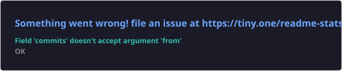

Computer Science Undergraduate · Full-Stack Developer · GenAI Explorer

 

  

👋 About Me

I’m Utkarsh Prajapati, a Computer Science undergraduate at NIIT University focused on building practical software products and real-world technology solutions.

My interests span software engineering, full-stack development, Java, Python, Generative AI, and IoT. I enjoy taking an idea from problem definition to implementation, deployment, and iteration.

🎓 B.Tech Computer Science & Engineering — NIIT University

💻 Building with Java, Python, JavaScript, React.js, Next.js, Firebase, REST APIs and SQL

☕ Currently strengthening DSA, OOP, Spring Boot and Maven

🤖 Exploring Generative AI and Prompt Engineering

🌐 Experience building and deploying production-oriented web applications

🏆 1st Prize — Tech Tacular, NIIT University

🏆 6th Place — Samved Hackathon, MIT-VPU, among 500+ teams

🌍 Open Source Contributor — ELUSOC 2026, Global Rank #34

🚀 Open to software engineering, full-stack development and GenAI opportunities

🛠️ Tech Stack

Languages

Frontend

Backend, Databases & APIs

REST APIs · Firestore · DBMS · SQL

AI, Development & Tooling

Generative AI · Prompt Engineering · IoT · Maven

🤖 AI / GenAI Expertise

Domain

Proficiency

Focus

Generative AI

Working Knowledge

AI integration and practical application development

Prompt Engineering

Working Knowledge

Designing structured prompts and AI-assisted workflows

AI Integration

Working Knowledge

Exploring how GenAI can enhance software products

🚀 Featured Projects

<b>FinFlow — MSME Cash Flow Platform</b>

 

A fintech platform focused on helping Indian MSMEs track cash flow, categorize expenses, and improve financial visibility.

Area

Details

Stack

React.js · Firebase · REST APIs · Vercel

Core Features

Cash-flow tracking · Expense categorization · INR dashboards · Plan management

Backend

Firebase Authentication · Real-time Firestore

Deployment

Vercel

Impact

Presented at Rajasthan Startup Summit 2026 and submitted to F6S

Repository

GitHub Profile

<b>Shreeji Vastraalay — Production E-Commerce Platform</b>

 

A production-oriented e-commerce platform for devotional products with online ordering and payment integration.

Area

Details

Stack

Next.js 15 · Firebase · Razorpay · Tailwind CSS · Vercel

Core Features

Authentication · Product/order management · Cart · Checkout · Validation

Payments

Razorpay integration

Deployment

Vercel · Custom GoDaddy domain

Security

Revoked an exposed production API key, purged Git history using BFG Repo Cleaner, and migrated secrets to environment variables

SEO

Google Search Console · Google Business Profile

Repository

GitHub Profile

<b>Smart Water Pressure Management System</b>

 

An IoT-based smart-city solution designed to address unequal water pressure across 13 distribution zones for Solapur Municipal Corporation.

Area

Details

Stack

Arduino Uno · PS3 Pressure Sensors · Flow Sensors · IoT

Monitoring

Pressure and dual-flow sensor architecture

Detection

Flow-differential leakage detection

Dashboard

Zone maps · Real-time graphs · Controls · SMS alerts

Recognition

6th Place — Samved Hackathon, MIT-VPU, among 500+ teams

Repository

GitHub Profile

<b>IoT-Based Animal Tracking & Health Monitoring System</b>

 

An IoT-based project focused on animal tracking and health monitoring.

Area

Details

Domain

IoT · Animal Health Monitoring

Recognition

🥇 1st Prize — Tech Tacular, Sinusoid V8, NIIT University

Repository

GitHub Profile

<b>Aurora Restaurant Website</b>

 

Responsive multi-section promotional website featuring a menu, gallery and reservation call-to-action.

Area

Details

Focus

Responsive Web Development

Performance

Sub-2s load time

Compatibility

Cross-browser compatible

Repository

GitHub Profile

<b>HealthPlus Healthcare Platform</b>

 

Healthcare services website with doctor profiles, appointment-booking sections and patient testimonials.

Area

Details

Focus

Web Development

Accessibility

95+ Google Lighthouse accessibility score

Repository

GitHub Profile

<b>Stone-Paper-Scissors — Java</b>

 

Console-based Java game demonstrating OOP principles, conditional logic and user-input handling.

Area

Details

Language

Java

Concepts

OOP · Conditional Logic · Input Handling

Repository

GitHub Profile

💼 Experience

Software Engineering Intern — Zaalima Development Pvt. Ltd.

May 2026 – June 2026 · Remote

Contributed to VaultCore Financial and ShopScale Fabric, supporting fintech and e-commerce application development.

Engineered backend API integrations, relational database components, frontend features and application workflows.

Worked with Git workflows, code reviews and sprint planning throughout development cycles.

🌍 Open Source

ELUSOC 2026 — EduLinkUp Summer of Code

Global Rank #34 · 50 Points · Stone Coder Badge

Contributed to the ELUSOC 2026 open-source program and participated from June through August 2026.

🏆 Achievements

Recognition

Details

🥇 1st Prize

Tech Tacular Competition — Sinusoid V8, NIIT University

🏆 6th Place

Samved Hackathon — MIT-VPU, among 500+ teams

🌍 Global Rank #34

ELUSOC 2026 — EduLinkUp Summer of Code

🚀 Finalist

Hack on Titan — Ideakode

🇮🇳 Qualified

India Invotes Hackathon — National Level

💼 Startup Summit

Represented FinFlow at Rajasthan Startup Summit 2026

📜 Certifications & Job Simulations

Google Cloud / Generative AI

Introduction to Generative AI — Simplilearn SkillUP

Generative AI Studio — Simplilearn SkillUP

Software Engineering

Software Engineering Job Simulation — JPMorgan Chase & Co. / Forage

Technology Job Simulation — Deloitte / Forage

Software Development Job Simulation — Datacom / Forage

Finance

SEBI Investor Awareness Test — NISM

💻 Coding Profile

## 📊 GitHub Analytics

  
  

  

🏅 GitHub Trophies

📈 Contribution Activity

🐍 Contribution Snake

🎯 Current Focus

learning:
  - Data Structures & Algorithms
  - Spring Boot
  - Maven
  - Advanced Java
  - Generative AI

building:
  - Full-stack web applications
  - Practical software engineering projects
  - AI-integrated applications

exploring:
  - Backend engineering
  - GenAI product integration
  - Scalable application architecture

open_to:
  - Software Engineering Internships
  - Full-Stack Development Opportunities
  - GenAI / AI Engineering Opportunities
  - Open Source Collaboration

🤝 Connect

Building practical software, learning continuously, and turning ideas into products.

